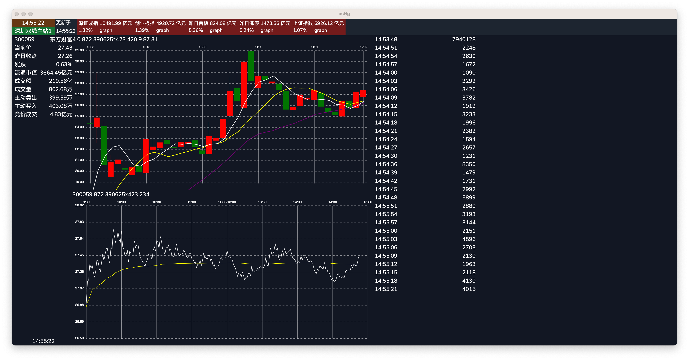

# WIP: asNG

Next Generation A share trade station!

> DaBanShiWeiYiChuLu.

Preview:

## Features

- [ ] market emotion overview
    - [ ] index overview panel
    - [ ] 昨日连板 昨日首板 指数
    - [ ] volume day-over-day change
- [ ] 集合竞价
- [ ] realtime
    - [ ] base feature
    - [ ] base information
    - [ ] crosshair
    - [ ] aggregate transaction and show on graph
- [ ] candle stick
    - [x] base feature
    - [ ] crosshair
    - [ ] volume and amount
- [ ] level2 support
- [ ] github action auto release